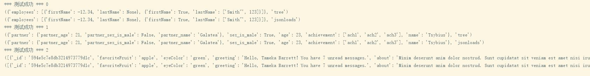

# simple-json-parser
用来学习的简易的 JSON 解析器，慢慢填

目前已支持
- 处理各种数据格式，NUMBER STRING BOOL 均可转换为 python 对应的对象
- 处理嵌套的数据结构 Object Array
- 处理转义，出 unicode 外效果与 json.loads一致

## 测试效果

## 大体思路
- JSON 文法
  - 暂时不考虑错误处理，假定输入的是正确数据
> NUMBER,  
        STRING,  
        ARRAY,  
        OBJECT,  
        TRUE,  
        FALSE,  
        NUL,  
        UNKNOWN

- 词法分析
  - ~~直接 python 内置函数？~~
  - 分解为 ele
  - token 一共有一下几种类型
    - STRING
    - NUMBER
    - START_ARRAY
    - END_ARRAY
    - END_OBJ
    - COMMA
    - COLON
    - BOOLEN
    - END_DOC
- 语法分析
  - DFA
  - 递归
- 转义字符处理
